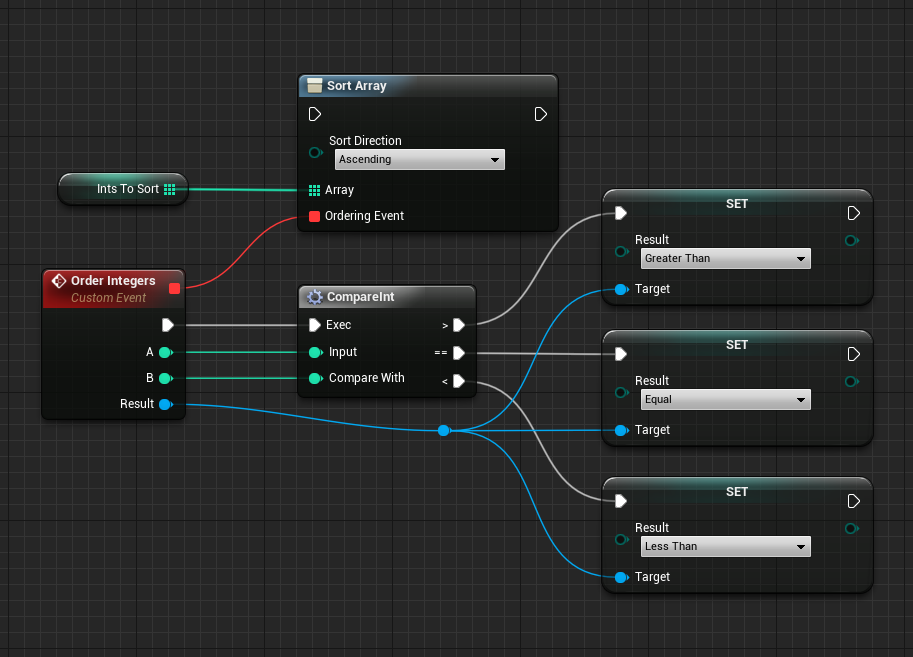
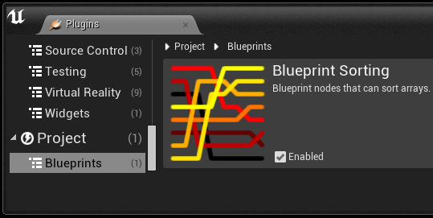
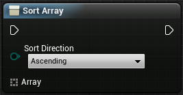
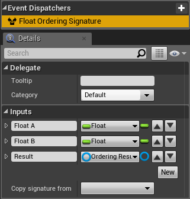
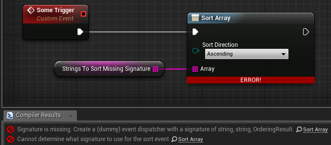
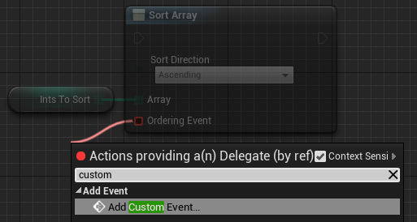
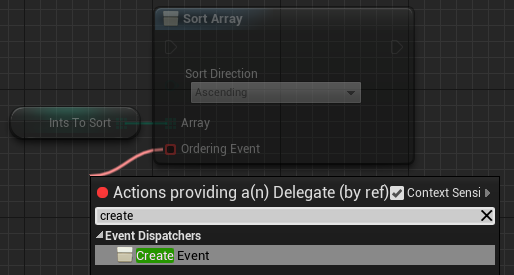

Blueprint Sorting
=================

Overview
--------

BlueprintSorting is a plugin for [Unreal Engine 4](https://www.unrealengine.com/) that allows arrays to be sorted with functions in-place in blueprints.

One custom node is included in this plugin along with a few helpers.

Note that the current sorting algorithm is highly inefficient and will be replaced when I need it.
It will work fine on small arrays but expect slowness if a thousand element array is to be sorted.

Installation
------------

### Integration

There are a couple of different ways to integrate this plugin into your project. You can include it in your fork of the UE4 engine or you can include it in a single UE4 code-based project if you like.

#### In your engine

This method includes the plugin in your fork of the UE4 engine. It allows you to use the plugin in either code or blueprint-based projects that are created with your fork of the engine. It assumes you have already cloned the UE4 engine to a directory on your machine.

1. Clone this repo to a subfolder of your engine called /Engine/Plugins/BlueprintSorting. Optionally, you can add it as a submodule.
2. Run the GenerateProjectFiles script in the Engine root.
3. Open your engine project file and build the editor.

#### In your code project

This method includes the plugin in a single code-based project. This can be done on any code-based project that is created using the Github source engine or the one provided by Epic via the launcher.

1. Clone this repo to a subfolder in your project called /Plugins/BlueprintSorting.
2. Open your project. You will be prompted to build missing modules.
3. Select Yes to rebuild now.

### Enable the Plugin

Ensure that the plugin is enabled:

1. In the editor, select Plugins from the Window menu.
2. Search for the plugin called Blueprint Sorting. It's in the Blueprints category.
3. Check the Enabled checkbox on the plugin. You may have to restart the editor after this step.

Sort Array node
---------------

### Initial state

This is how a sort array node starts off. 

The *Sort Direction* input pin decides if the array should be sorted from lowest to highest or highest to lowest.
It takes an enum of the type `ESortDirection` which has the members `Ascending` and `Descending`.
This enum is defined in C++ and is included in this plugin.

The *Array* input pin initially accepts any type of array. The array it is connected to will get sorted in-place when this *Sort Array* node is triggered.

The ordering event input pin only appears when the array input pin is connected.

### State when connected to an array

When the node is connected to an array the ordering event input pin will appear if a relevant event signature can be found.
It would be nice if this was not required.
There must exist some event dispatcher anywhere in the project that has the inputs *type of array*, *type of array*, *Ordering Result*.
e.g. if an array of floats is to be sorted then there needs to be an event dispatcher somewhere with the signature *float*, *float*, *Ordering Result*.

If such an event dispatcher is not found then an ordering event pin will not be added to the node.
If the node has its exec pin connected to something and the relevant blueprint is compiled then errors will be reported in the *Compiler Results* window.

If a relevant event dispatcher is found then the ordering event pin will be created.

Note that the event dispatcher is just there as a dummy. It is not recommended to used them for anything else aside from providing signatures. 
It is recommended to dump all the event dispatchers needed in one place for tidyness.
If some dummy object is used to store all the signatures and it is not actually used then ensure that is gets cooked.

### The ordering event pin

The ordering event pin must be connected to some event (or function via the *Create Event* node).
The connected event must determine if one items is greater than, equal to, or less than some other item.
Normally some ordering function would be expected to return a result stating if one item is larger than the other. 
However events only have inputs and not outputs thus an `Ordering Result` object is supplied and the event is expected to set its `Result` variable to something.

#### Order by custom event

One way to provide an ordering event is to connect the *Sort Array* node to a *Custom Event* node.

Note that support for this depends on the blueprint type. A blueprint function library does not support this.

The event will have inputs of item A, item B and the ordering result.
The event must compare item A to item B and set the variable *Result* of the input ordering result to 
*Greater Than* if item A is greater than item B, *Equal* if item A is equal to item B, or *Less Than* if item A is less than item B.
It is not defined what will happen if the *Result* variable is not set.

#### Order by create event

The other way to provide an ordering event is to connect the *Sort Array* node to a *Create Event* node.

This allows some function to be used. This function can either be in the same blueprint or supplied by another object.

Internal details
----------------

The base functionality for the node is provided by the class `UBPNode_BaseSortArray`. 
The actual sort array node is the class `UBPNode_SortArray`.
If other sort algorithms are added (e.g. anything other than bubble sort) then other sort array node classes may be created.

The tricky issue is that the sort algorithm must be supplied by building up a series of statements for the node.
If there is an alternative I would like to know it!
As a proof of concept the [bubble sort algorithm](https://en.wikipedia.org/wiki/Bubble_sort) has been implemented since this was easiest to write.
When needed I will add a [quicksort](https://en.wikipedia.org/wiki/Quicksort) implementation.

The node is compiled with the relevant subclass of `FNodeHandlingFunctor`. 
The base functionality is provided by class `BPCHandler_BaseSortArray`.
The compile of the sort algorithm is supplied by a subclass of `BPCHandler_BaseSortArray`.
As of now only bubble sort has been implemented and this can be found in `BPCHandler_BubbleSortArray`.

The `UBlueprintSortingHelperLibrary` helper class contains various functions to help the sorting algorithm.
